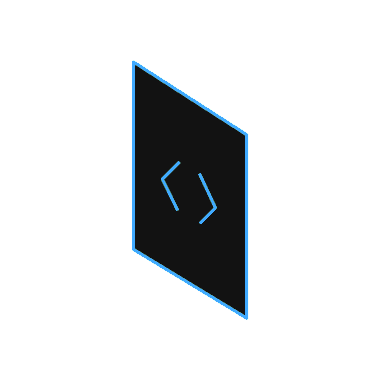

<h2 align="center">Basic infrastructure</h2>

Basic infrastructure for setting up multiple services including:

- Nginx - reverse proxy for setting up multiple subdomains
- Gitea - self hosted version control
- Drone - CICD runner
- Portainer - tool for managing and tracking containers

Also this repo contains daemon for automatic updates when repo recieves some changes.

### Plan:

- add uptime kuma
- add builder with different colors
- change drone to woodpecker
- add container with mail and prepare it
