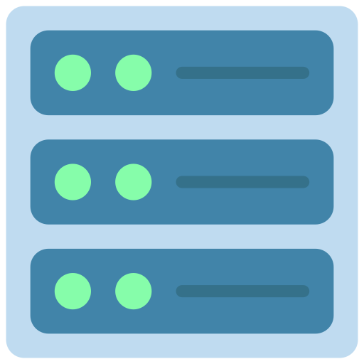

<p align="center">

</p>

<h2 align="center">Infr - open infrastructure</h2>

[](https://fmnx.su/infr/fmnx/src/branch/main/LICENSE)
[](https://fmnx.su/core/infr)
[](https://codeberg.org/fmnx/infr)
[](https://github.com/fmnx-io/infr)
[](https://www.flaticon.com)

This repository contains all code, related to fmnx project infrastructure. All infrastructure elements are containerized applications to reduce headache. Only free and open source docker containers have been used.

This repo contains following elements:

- [Gitea](https://about.gitea.com/) with customized theme and parameters and API.
- [Postgres](https://www.postgresql.org/) for user data.
- [Minio](https://min.io/) for blobs, files, packages and LFS.
- [Docker mail](https://github.com/docker-mailserver/docker-mailserver) as gitea's mailer service.

Also [certbot-docker](https://hub.docker.com/r/certbot/certbot) and [lego](https://github.com/go-acme/lego) are used to obtain certificates.

---

## Local setup

Local version has all containers tied up in single docker-compose file. It can be used for local tests and UI adjustments.

1. Clone the repository.

```sh
git clone https://fmnx.su/core/infr
```

2. Run containers with `docker-compose`.

```sh
docker compose up
```

If you are plannig to use infrastructure for a team, preferably run setup across multiple nodes.

---

## Setup postgres

1. SSH into postgres vm.

```sh
ssh user@vm
```

2. Clone infrastructure repo.

```sh
git clone https://fmnx.su/core/infr
```

3. Cd into postgres folder.

```sh
cd infr/postgres
```

4. Add postgres credentials to `.env` file.

```sh
echo POSTGRES_USER=user >> .env
echo POSTGRES_PASSWORD=password >> .env
echo POSTGRES_DB=db >> .env
```

5. Start postgres with `docker-compose` and disconnect.

```sh
docker compose up
```

Verify, that postgres is up and running, by connecting with your client, i prefer [sqltools](https://open-vsx.org/extension/mtxr/sqltools) vscodium extension with postgres driver. Alternatively you can use [pgadmin](https://www.pgadmin.org/) or another postgres UI of your preference.

---

## Setup Minio

1. SSH into minio vm.

```sh
ssh user@vm
```

2. Clone infrastructure repository.

```sh
git clone https://fmnx.su/core/infr
```

3. Cd into minio folder.

```sh
cd infr/minio
```

4. Add minio credentials to `.env` file.

```sh
echo MINIO_ACCESS_KEY=123456 >> .env
echo MINIO_SECRET_KEY=987654321 >> .env
```

5. Start minio with `docker-compose`.

```sh
docker compose up
```

---

### Setup email

1. SSH into email vm.

```sh
ssh user@vm
```

2. Clone infrastructure repository.

```sh
git clone https://fmnx.su/core/infr
```

3. Cd into email-server folder.

```sh
cd infr/mail
```

4. Obtain sertificates from letsencrypt. Before that you should ensure, that you have proper routing adjusted in your DNS server, and traffic from domain can reach the email VM. Script uses [letsencrypt](https://letsencrypt.org/) for obtaining TLS sertificates.

```sh
docker run --rm -it -v "${PWD}/data/certbot/certs/:/etc/letsencrypt/" -v "${PWD}/data/certbot/logs/:/var/log/letsencrypt/" -p 80:80 docker.io/certbot/certbot certonly --standalone -d mail.example.com
```

5. Start email docker container.

```sh
docker compose up
```

6. Sh into `docker-email` container and add new users.

```sh
docker exec -it mail /bin/bash
```

6. Add email users.

```sh
setup email add admin@example.com passwd123
```

---

### Setup gitea

1. SSH into gitea vm.

```sh
ssh user@vm
```

2. Clone infrastructure repository.

```sh
git clone https://fmnx.su/core/infr
```

3. Cd into gitea-server folder.

```sh
cd infr/mail
```
