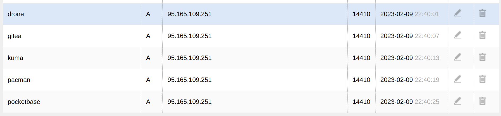
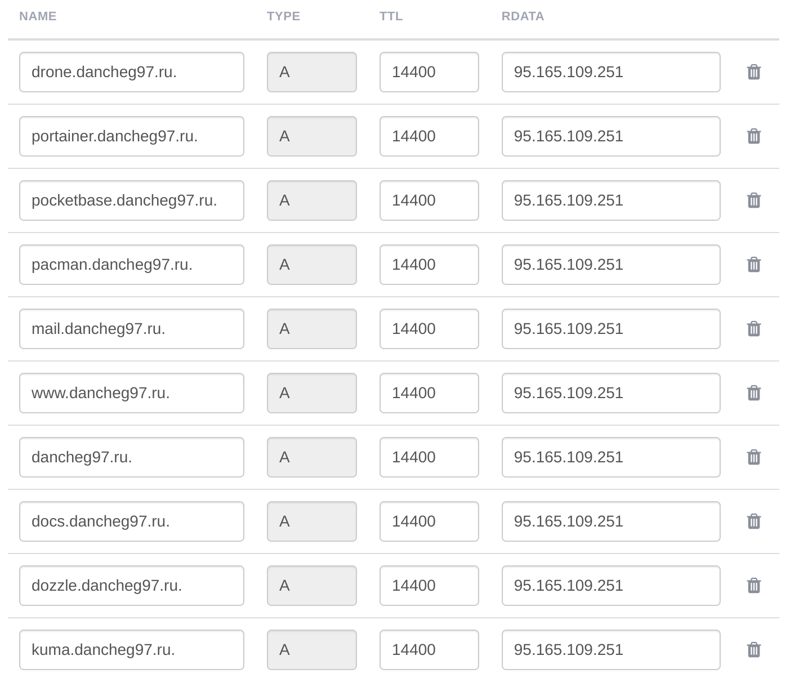

# Self-hosted инфраструктура за 10 минут

Всем привет!

В этом туториале хотелось бы рассказать о том, как можно очень быстро развернуть минимальный набор сервисов необходимых для разработки ПО на дешевом хостинге или слабом железе. Данный набор подойдет для небольших команд или в качестве персонального решения.

Все инструменты имеют открытый исходный код, не имеют платных версий и предоставляются по открытым лицензиям, поэтому их можно использовать как для личных проектов, так и в организациях при разработке ПО в коммерческих целях.

## Используемые сервисы

- [Gitea](https://gitea.io/en-us/) - ПО для хостинга IT-проектов и совместной разработки на базе Git. Будет использоваться для хранения кодовой базы и удобного доступа к коду. Данный инструмент является хорошей альтернативой гитлабу, но не имеет интегрированного `CI-CD`, поэтому в данном списке есть следующий сервис.

<center>

</center>

- [Drone](https://www.drone.io/) - система непрерывной интеграции, написанная на Go. Её можно использовать для CI-CD и подключить как сторонюю систему к `github`, `gitea`, `GOGS`, `bitbucket`, в нашем слечае к `gitea`.


<center>

</center>

- [MkDocs](https://squidfunk.github.io/mkdocs-material/) - это инструмент,  для создания сайтов статической документации на основе файлов [markdown](https://www.markdownguide.org/). Данный сервис может использоваться для хранения и отображения документации по проекту.Тинькоф используют данный инструмент для предоставления информации по [публичным API](https://tinkoff.github.io/investAPI/grpc/).

<center>

</center>

- [Uptime Kuma](https://github.com/louislam/uptime-kuma) - это простой инструмент для мониторинга и сбора статистики работоспособности других сервисов. Так же имеет функционал для отправки уведомлений в случае потери доступности какого-либо компонента.

<center>

</center>

- [Dozzle](https://github.com/amir20/dozzle) - простое веб приложение для просмотра логов запущенных на хосте контейнеров. Позволяет выполнять поиск по логам и мониторить обзий уровень загрузки. Приложение не сохраняет данные и переиспользует логи которые хранятся в `docker` или `swarm`. 

<center>

</center>

- [Nginx](https://www.nginx.com/) - это веб-сервер и почтовый прокси. В данном месте используется для маршрутизации между остальными элементами инфраструктуры.

## Подготовка DNS

Перед тем как разворачивать инфраструктуру необходимо настроить DNS, для перенаправления трафика по необходимым адресам. Как правило это можно сделать у регистратора доменного имени. 

Вот примеры для `nic.ru` и `fozzy.com`:




## Генерация docker-compose

Далее мы воспользуемся утилитой [gen-tools](https://github.com/Dancheg97/gen-tools), которая позволяет быстро собрать необходимый `docker-compose` со всеми элементами инфраструктуры и подготовить необходимые конфигурации в `nginx` и остальных сервисах.

Установить данную утилиту можно используя `go`, `docker` или `yay`, я покажу вариант с `go`:

```sh
go install dancheg97.ru/dancheg97/gen-tools@latest
```

Далее запустим команду для генерации конфигураций в пустой директории, вот пример:

```sh
gen-tools infr --name ctrl2Go --domain ctrl2go.su --user admin --pass password --email example@ctrl2go.su
```

После генерации необходимо получить сертификаты для возможности валидного доступа через `https`, достаточно запустить скрипт `certs.sh`, который сразу получит все сертификаты на все поддомены. Скрипт использует [lego](https://github.com/go-acme/lego), инструмент для получения сертификатов из [letcencrypt](https://letsencrypt.org/docs/client-options/).

```sh
sh certs.sh
```

## Запуск сервисов

После получения сертификатов мы должны увидеть папку `.lego`, которая содержит все необходимые файлы, далее можно запускать сервисы. Это можно сделать с командой:

```sh
docker compose up
```

После того, как все сервисы активны, нужно запустить старт `gitea`, подключить `drone`, и задать мониторинг `uptime-kuma`.

Все эти действия ин
